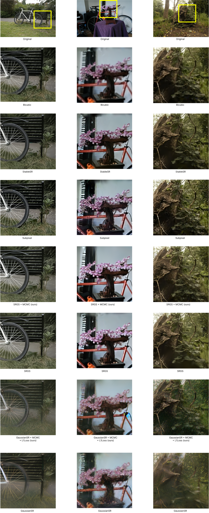

# Enhancing Gaussian Splat Scene Representation Using Diffusion-Based Super Resolution
## Executive summary
3D Gaussian Splats as a method for scene reconstruction has gained popularity due to the quality of novel view synthesis (NVS), fast training, and real-time rendering of viewpoints. Despite the impressive results of the method, models trained on low-resolution images suffer from sparse primitives and a lack of texture when generating higher-resolution projections (High Resolution Novel View Synthesis, HRNVS). The most successful solutions to the HRNVS problem are methods based on super-resolution models. In the SRGS paper, it was proposed to use super-resolution models and regulate training with original resolution images to eliminate generative artifacts. Another approach was presented in the GaussianSR paper, which used score distillation sampling from diffusion models. Both methods showed improved reconstruction quality in high-resolution space. In this work, we thoroughly analyze the aforementioned methods and reproduce their experiments. We also propose a number of improvements and conduct extended validation, which includes algorithmic interpolation and simple training on images synthesized by a super-resolution model. We perform validation of the core methods and our enhancements on the Mip-NeRF 360 dataset. To our surprise, the most effective methods in terms of statistical metrics turned out to be bicubic interpolation and simple training on images synthesized by a super-resolution model, followed by training the Gaussian splats on these generated images.


## How to run this code

Pull StableSR and apply compatibility patch
```
git submodule init
git submodule update
git apply StableSR_compatibility.patch ./StableSR
```

Create environment and install dependencies
```
conda create -n sds_splats python=3.10
pip install -r requirements.txt
```

Pull the dataset for MipNerf360
```
python datasets/download_dataset.py
```

Get checkpoints for StableSR
```
# for U-net
wget https://huggingface.co/Iceclear/StableSR/resolve/main/stablesr_000117.ckpt ./StableSR
# for VAE
wget https://huggingface.co/Iceclear/StableSR/resolve/main/vqgan_cfw_00011.ckpt ./StableSR
```

Downscale images to 16 for original size using script
```
bash ./scripts/local_colmap_and_resize.sh ./data/360_v2/bonsai
bash ./scripts/local_colmap_and_resize.sh ./data/360_v2/stump
bash ./scripts/local_colmap_and_resize.sh ./data/360_v2/bicycle
```

Upscale images from x16 to x4 using bicubic interpolation and StableSR upscale
```
# bicuibic
PYTHONPATH=$PYTHONPATH:./StableSR python3 dataset_upscaler.py --data-factor 16 --scale-factor 4 --data-dir ./data/360_v2/bonsai
PYTHONPATH=$PYTHONPATH:./StableSR python3 dataset_upscaler.py --data-factor 16 --scale-factor 4 --data-dir ./data/360_v2/stump
PYTHONPATH=$PYTHONPATH:./StableSR python3 dataset_upscaler.py --data-factor 16 --scale-factor 4 --data-dir ./data/360_v2/bicycle
# stableSR

PYTHONPATH=$PYTHONPATH:./StableSR python3 dataset_upscaler.py --data-factor 16 --upscale-type stablesr --scale-factor 4 --data-dir ./data/360_v2/bonsai
PYTHONPATH=$PYTHONPATH:./StableSR python3 dataset_upscaler.py --data-factor 16 --upscale-type stablesr --scale-factor 4 --data-dir ./data/360_v2/stump
PYTHONPATH=$PYTHONPATH:./StableSR python3 dataset_upscaler.py --data-factor 16 --upscale-type stablesr --scale-factor 4 --data-dir ./data/360_v2/bicycle
```

To use densification dropout substitute default strategy fily in gsplat
```
cp default_new.py ~/miniconda3/envs/sds_splats/lib/python3.10/site-packages/gsplat/strategy/default.py
```

To reproduce evaluation done in the table one can use `sbatch_runner_3d.py` script. Those executions should be done in the sequantial order

```
python3 sbatch_runner_3d.py --debug --thesis > example_run_commands
```


## Quantative results
| Method / Scene                     | Bicycle              |        |         | Stump               |        |         | Bonsai              |        |         |
|----------------------------------|----------------------|--------|---------|---------------------|--------|---------|---------------------|--------|---------|
|                                  | PSNR ↑               | SSIM ↑ | LPIPS ↓ | PSNR ↑              | SSIM ↑ | LPIPS ↓ | PSNR ↑              | SSIM ↑ | LPIPS ↓ |
| **Bicubic**                      | **22.62**            | **0.50** | 0.59    | **24.58**           | **0.59** | 0.49    | **26.79**           | **0.76** | 0.38    |
| **StableSR**                     | _22.21_              | 0.48   | 0.48    | _23.45_             | 0.53   | 0.42    | _26.22_             | **0.76** | _0.26_  |
| **Subpixel**                     | 21.42                | _0.49_ | **0.30**| 22.12               | 0.50   | **0.29**| 22.16               | 0.60   | **0.23**|
| **SRGS + MCMC (ours)**          | 21.80                | _0.49_ | _0.43_  | 23.09               | _0.54_ | _0.36_  | 25.11               | _0.75_ | _0.26_  |
| **SRGS**                         | 21.52                | 0.47   | 0.50    | 22.49               | 0.51   | 0.44    | 25.03               | _0.75_ | _0.26_  |
| **GaussianSR + MCMC + L1Loss (ours)** | 20.04          | 0.36   | 0.45    | 21.64               | 0.41   | 0.47    | 20.51               | 0.52   | 0.35    |
| **GaussianSR**                   | 19.10                | 0.34   | 0.57    | 20.51               | 0.38   | 0.55    | 19.87               | 0.50   | 0.38    |

## Visual comparison


